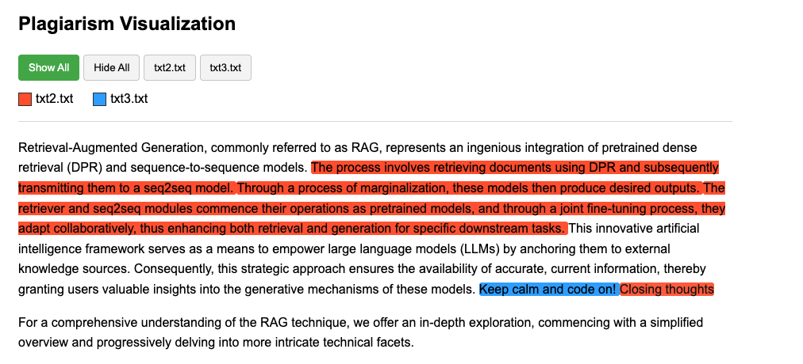

# Sentence Plagiarism Checker

A tool to compare sentences from an input document with all sentences from reference documents to find similar content.


## Overview

A command-line tool for detecting sentence-level plagiarism using the Jaccard similarity algorithm. This tool allows users to compare an input document against multiple reference documents and identify similar sentences.

## Features

- Detects sentence-level plagiarism using Jaccard similarity.
- Configurable similarity threshold.
- Filters sentences by minimum length.
- Outputs results in text and JSON format.
- Quiet mode to suppress console output.
- Interactive HTML visualization of plagiarized content.

## Text Splitting

The tool splits text into sentences using intelligent sentence boundary detection:

- Uses regex pattern to identify sentence endings (periods, question marks, exclamation points)
- Avoids splitting abbreviations (e.g., "e.g.", "Dr.") or initials (e.g., "A.B.")
- Tracks sentence positions within the original document for accurate reporting
- Filters sentences by minimum length for more relevant comparisons

## Supported Similarity Metrics

The tool supports several similarity metrics for comparing sentences:

- **Jaccard Similarity** (default): Measures similarity based on the size of the intersection divided by the size of the union of word sets
- **Cosine Similarity**: Measures the cosine of the angle between word frequency vectors
- **Jaro Similarity**: String-based similarity measure that accounts for character matches and transpositions
- **Jaro-Winkler Similarity**: An extension of Jaro similarity that gives higher weights to matches at the beginning of the strings
- **Overlap Similarity**: Measures the overlap between two sets divided by the size of the smaller set
- **Sørensen-Dice Similarity**: Calculates similarity as twice the number of common terms divided by the sum of the cardinalities
- **Tversky Similarity**: An asymmetric similarity measure that extends Jaccard similarity with parameters for weighting differences

## Installation

Install in an isolated environment using pipx:

```sh
pipx install sentence-plagiarism
```

## CLI Usage

```sh
sentence-plagiarism <path-to-input-file> <path-to-reference-file-1> ... [--threshold <threshold-value>] [--output_file <path-to-output-file>] [--quiet] [--min_length <min-length>]
```

### Arguments

- `<input_file>`: Path to the input file to be checked for plagiarism.
- `<reference_files>`: Paths to one or more reference files to compare against.
- `--threshold`, `-t`: (optional) Minimum similarity score (0-1) to consider a sentence plagiarized. Default: 0.8.
- `--output`, `-o`: (optional) Path to save results in JSON format. Default: `results.json`.
- `--text_output`, `-to`: (optional) Path to save results in text format.
- `--quiet`, `-q`: (optional) Suppress console output.
- `--min_length`, `-ml`: (optional) Minimum sentence length to include in the comparison. Default: 10.
- `--metric`, `-m`: (optional) Similarity metric to use for comparison. Options: jaccard_similarity, cosine_similarity, sorensen_dice_similarity, overlap_similarity, tversky_similarity, jaro_similarity, jaro_winkler_similarity. Default: jaccard_similarity.

### Example

```sh
sentence-plagiarism input.txt ref1.txt ref2.txt --threshold 0.8 --output results.json --min_length 10 --metric jaccard_similarity
```

## Visualization

The tool includes a powerful visualization capability that creates interactive HTML reports for easier plagiarism analysis.



### CLI Visualization Usage

```sh
python -m sentence_plagiarism.plagiarism_visualizer --input <input-markdown-file> --plagiarism-data <json-results-file> --output <output-html-file>
```

### Visualization Features

- Color-coded highlighting of plagiarized content
- Interactive filters to show/hide matches from different reference documents
- Hover tooltips showing matching reference document and similarity score
- Opacity level indicating similarity strength (higher opacity = higher similarity)
- Document legend for easy reference identification
- Supports Markdown content with proper rendering

## Programmatic Usage

```python
from sentence_plagiarism import check

# Basic usage
check(
    examined_file="input.txt",
    reference_files=["ref1.txt", "ref2.txt"],
    similarity_threshold=0.8,
    output_file="results.json",
    text_output_file="results.txt",
    quiet=False,
    min_length=10,
    similarity_metric="jaccard_similarity"
)

# Visualization from Python
from sentence_plagiarism.plagiarism_visualizer import load_files, generate_document_colors
from sentence_plagiarism.plagiarism_visualizer import create_html_with_highlights, generate_final_html, save_html

# Generate visualization
markdown_content, plagiarism_matches = load_files("input.md", "results.json")
doc_colors = generate_document_colors(plagiarism_matches)
html_with_highlights = create_html_with_highlights(markdown_content, plagiarism_matches, doc_colors)
final_html = generate_final_html(html_with_highlights, doc_colors, plagiarism_matches)
save_html(final_html, "plagiarism_report.html")
```

## Testing

Run the test suite using:

```sh
pytest
```

## Contributing

1. Fork the repository.
2. Clone your fork:

   ```sh
   git clone https://github.com/your-username/sentence-plagiarism.git
   ```

3. Install dependencies:

   ```sh
   pip install -r requirements.txt
   ```

4. Run tests:

   ```sh
   pytest
   ```

## FAQ

### Why is my output empty?

Ensure that the sentences in your input and reference files meet the `--min_length` requirement.

### How do I install pipx?

Refer to the [pipx documentation](https://pipxproject.github.io/pipx/installation/) for installation instructions.

### What are the typical use cases for the supported metrics in the task of sentence plagiarism detection?

- **Jaccard Similarity**: Best for detecting direct word-for-word plagiarism where the order of words isn't crucial. Most effective when comparing technical content where specific terminology must be preserved. Focuses on shared vocabulary between sentences.

- **Cosine Similarity**: Ideal for longer texts where term frequency matters. It can detect plagiarism even when additional words are inserted or the sentence structure is modified, as it focuses on the angular similarity of word frequency vectors rather than exact matches.

- **Jaro Similarity**: Well-suited for detecting typographical errors or minor spelling changes in plagiarized content. This metric is particularly effective for shorter sentences where character-level similarity is important.

- **Jaro-Winkler Similarity**: Preferred when the beginning portions of sentences are more significant than later parts. Especially useful for detecting plagiarism in academic writing where introductory phrases are often preserved while later portions might be paraphrased.

- **Overlap Similarity**: Best when one text is significantly shorter than the other or when dealing with partial matches. It's useful for identifying when a short, distinctive phrase from one document appears within a longer sentence in another.

- **Sørensen-Dice Similarity**: Provides a balanced approach that gives more weight to matching terms than Jaccard. Particularly effective for medical or scientific texts where shared technical terminology is highly indicative of plagiarism.

- **Tversky Similarity**: Offers flexibility through asymmetric weighting, making it ideal when you want to emphasize either precision or recall. Use when checking if a student paper contains content from reference materials (high alpha) or if reference materials contain content from a student submission (high beta).

## License

Distributed under the MIT License. See `LICENSE` for more information.

## Contact

Krystian Safjan - <ksafjan@gmail.com>

Project Link: [https://github.com/izikeros/sentence-plagiarism](https://github.com/izikeros/sentence-plagiarism)
